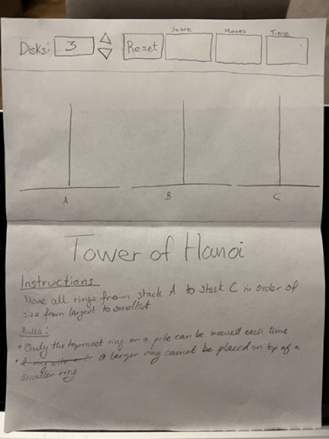
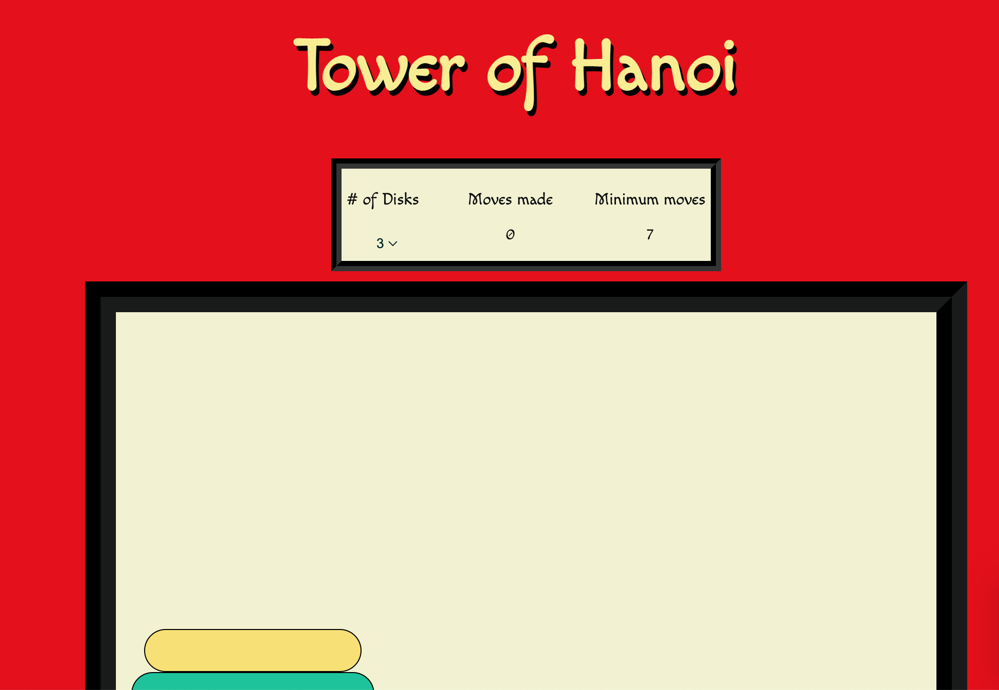
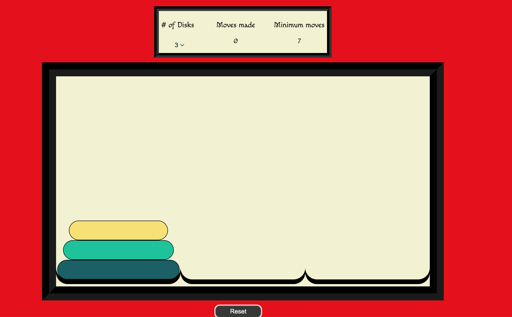
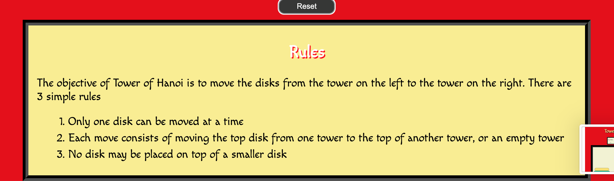
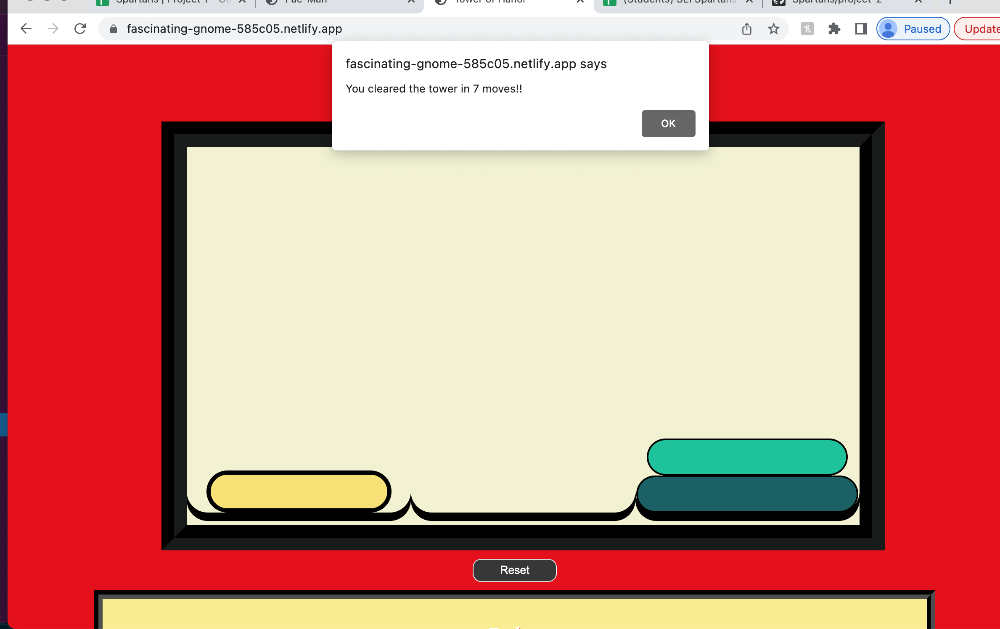

# Project: Tower of Hanoi

## Links:
- Wireframe:

- [Game link](https://fascinating-gnome-585c05.netlify.app/)

## Preview

This is a game of Tower of Hanoi with a minimum move counter, move counter and 3 level options.

## Technology used:

- I used vanilla javascript ( some jquery), css and html. 
- I used mostly css and DOM manipulation to create the pieces and gameboard.

## Approach:
The main approach to the game is using dom manipulation to create the 3-5 disks.
For checking the winning condition and keeping track of the moves in the game I used a boolean condition. 
### How I solved for the winner:
To check for the winner, I added an event listener to the last box that checked if the last disk was in the box. 
## Main features:
- drag down level options
- alert box displaying winning message
- number of moves tracker

## User Stories
-As a user, I want to be able to easily distinguish between the block sizes.
- As a user, I should be able to start a new game if I am stuck.
- As a user, I should be able to click on a disk and add it to another box.
- As a user, I should know the minimal number of moves it will take to clear the level.
- As a user, I should be given the logic and rules of the game in plain English.
- As a user, I should be shown a message when I win.
- As a user, I should not be able to continue playing once I win.

## What left?
- two modals: one linked to a button that pops up the instructions for the game. The second modal should display the winning message.
- setting a timer.

## References
-

